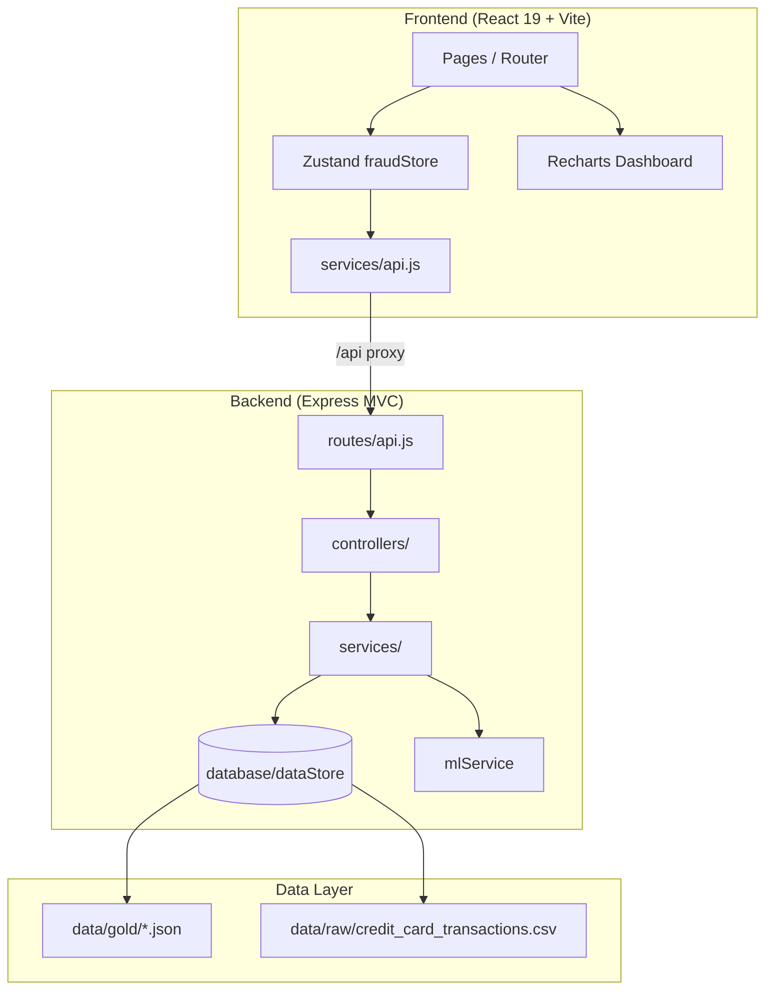

# FraudShield — Architecture Report

Enterprise fraud monitoring platform built as a decoupled React SPA + Node.js analytics API over a lakehouse-style data layer (gold JSON + raw CSV).

## System Overview



## Frontend Structure

```
frontend/src/
├── App.jsx                 # React Router + lazy-loaded pages
├── charts/                 # Recharts visualizations
├── components/
│   ├── filters/            # GlobalFilters
│   ├── transactions/       # TransactionDetailModal
│   └── ui/                 # Skeleton, EmptyState, ErrorBoundary
├── contexts/               # Barrel re-exports (compat)
├── context/                # Theme, Search, Filter, FraudData wrappers
├── hooks/                  # useTransactions, useDebounce
├── layouts/                # AppLayout (sidebar + outlet)
├── pages/                  # 6 route pages
├── services/api.js         # Centralized Axios + retry + aliases
├── stores/fraudStore.js    # Zustand global state (filters + KPIs)
├── styles/global.css       # Design tokens + animations
└── utils/                  # formatters, navigation
```

### State Management

| Layer | Responsibility |
|-------|----------------|
| **Zustand (`fraudStore`)** | Filters, KPIs, charts data, alerts, loading/error |
| **FilterContext** | Backward-compatible hook over Zustand |
| **FraudDataContext** | Triggers `fetchAll()` on filter change |
| **ThemeContext / SearchContext** | UI preferences, ⌘K search |

### Data Flow (Filters)

1. User changes filter in `GlobalFilters`
2. `fraudStore.setFilter()` updates state
3. `FilterSync` effect calls `fetchAll()` with query params
4. Parallel requests: `/kpis`, `/fraudes/*`, `/alertas`, `/analytics/summary`
5. KPI cards, charts, alerts re-render from store
6. `useTransactions` independently fetches `/transactions` with same filters

## Backend Structure

```
backend/
├── server.js               # Express entry
├── routes/api.js           # Route definitions
├── controllers/            # Request handlers
│   ├── healthController.js
│   ├── analyticsController.js
│   ├── transactionsController.js
│   └── mlController.js
├── services/               # Business logic
│   ├── analyticsService.js
│   └── mlService.js        # Isolation Forest pipeline (stub)
├── middleware/
│   ├── ensureReady.js
│   └── requestLogger.js
├── database/dataStore.js   # Re-export of lib/dataStore
├── lib/                    # Core engines (unchanged source)
│   ├── dataStore.js        # CSV + JSON cache
│   ├── riskEngine.js       # Multi-factor risk scoring
│   ├── filters.js          # Query parsing + aggregation
│   └── logger.js
└── utils/regions.js        # US state → macro-region
```

## Risk Engine

Multi-factor score (0–99) with levels `LOW | MEDIUM | HIGH | CRITICAL`:

| Factor | Weight |
|--------|--------|
| Transaction amount | up to 35 pts |
| Suspicious hour (22h–03h) | +22 pts |
| Critical category | +18 pts |
| Card velocity | up to +15 pts |

Outputs: `risk_score`, `risk_level`, `alert_level`, `status`

## API Endpoints

| Method | Route | Description |
|--------|-------|-------------|
| GET | `/health` | API readiness + stats |
| GET | `/kpis` | Executive KPIs (filtered) |
| GET | `/fraudes/categorias` | Category breakdown |
| GET | `/fraudes/horarios` | Hourly fraud heatmap data |
| GET | `/transactions` | Paginated transactions |
| GET | `/alertas` | Dynamic alerts |
| GET | `/modelos` | Model health |
| GET | `/analytics/summary` | Risk distribution + regions |
| GET | `/ml/predict` | Anomaly predictions |
| GET | `/ml/pipeline` | ML pipeline status |

### Filter Query Params

`period`, `category`, `status`, `risk_level`, `region`, `search`, `page`, `limit`, `sort`, `order`

## ML Pipeline (Ready for Extension)

Current: statistical z-score baseline in `mlService.js`  
Planned: Python Isolation Forest worker, Parquet feature export, model registry

Stages: `ingest → feature_engineering → train → infer → monitor`

## Performance & Resilience

- **Lazy loading** — route-level code splitting via `React.lazy`
- **Retry** — Axios interceptor (2 retries on 5xx/network)
- **Memoization** — Recharts + skeleton loading states
- **Logging** — `[API]` dev logs, `[SERVER]` request timing on backend

## Deployment Notes

- Frontend: Vite build → static host (Vercel/Netlify)
- Backend: Node 18+ on Railway/Render
- Env: `VITE_API_URL` for production API base

## Roadmap

- [ ] JSON transaction cache for instant cold start
- [ ] DuckDB + Parquet gold layer
- [ ] WebSocket real-time alerts
- [ ] Python ML worker (Isolation Forest)
- [ ] Docker Compose
- [ ] Playwright E2E tests
