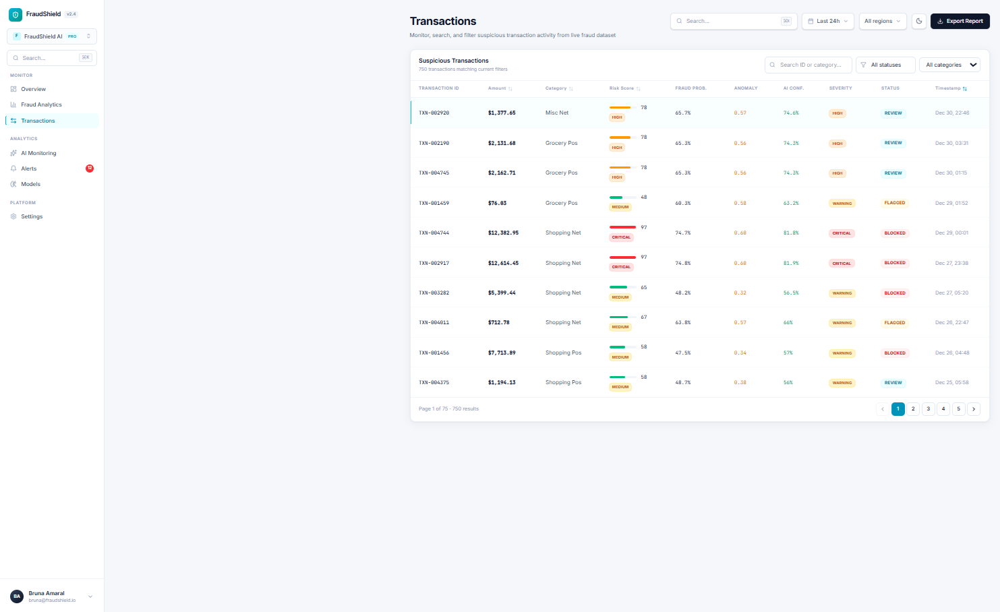
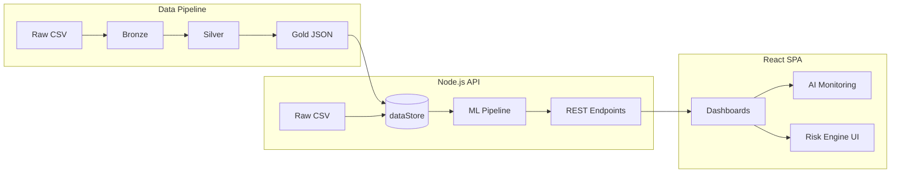

<div align="center">

# FraudShield

### Enterprise Fraud Analytics & AI Risk Intelligence Platform

**Real-time fraud observability · ML-powered anomaly detection · Multi-factor risk scoring**

[](https://react.dev/)
[](https://nodejs.org/)
[](https://python.org/)
[](./docs/ML_MODELS.md)
[](./data/README.md)

[Quick Start](#quick-start) · [Platform Preview](#platform-preview) · [Deploy Live Demo](./docs/DEPLOY.md) · [Architecture](./ARCHITECTURE.md) · [ML Models](./docs/ML_MODELS.md) · [API Reference](#api-endpoints)

</div>

---

## Overview

**FraudShield** is an enterprise-grade **fraud intelligence platform** designed for fintech operations, risk teams, and fraud analysts. It combines executive dashboards, AI monitoring, behavioral anomaly detection, and a multi-factor **Risk Engine** in a single observability surface — the kind of tooling you'd expect from a modern **fraud analytics SaaS**.

> Built to demonstrate production patterns: REST APIs, lakehouse data layers, ML inference pipelines, global filter sync, and explainable AI scoring.

| Metric | Value |
|--------|-------|
| Fraud transactions analyzed | **750** |
| Demo dataset | 5,000 rows (GitHub-optimized) |
| REST endpoints | **12+** |
| Risk levels | LOW · MEDIUM · HIGH · CRITICAL |
| ML models | Isolation Forest + Random Forest ensemble |

---

## Business Impact

Financial institutions lose billions annually to payment fraud. FraudShield addresses the operational gap between **raw transaction data** and **actionable risk intelligence**.

| Challenge | FraudShield Response |
|-----------|---------------------|
| **Fraud visibility** | Executive KPIs — fraud rate, volume, ticket size — updated in real time with global filters |
| **Risk intelligence** | Multi-factor Risk Engine scoring amount, velocity, category, and suspicious hours |
| **Anomaly detection** | Isolation Forest identifies behavioral outliers across 750+ fraud transactions |
| **Observability** | Unified dashboard for alerts, ML metrics, and transaction drill-down |
| **Fintech operations** | REST API layer ready for integration with payment processors, CRM, and case management |

**Outcome:** Analysts move from reactive review to **proactive fraud monitoring** — with severity-ranked alerts, AI confidence scores, and explainable risk breakdowns per transaction.

---

## Key Features

<table>
<tr>
<td width="50%" valign="top">

### AI Fraud Monitoring
- Dedicated `/ai-monitoring` command center
- Fraud probability distribution
- Anomaly timeline & risk heatmap
- Live AI-generated alerts

### Risk Score Engine
- Multi-factor scoring (amount, hour, category, velocity)
- Severity classification: `LOW` → `CRITICAL`
- Explainable risk breakdown per transaction
- Dynamic alert generation

</td>
<td width="50%" valign="top">

### ML Pipeline
- Feature engineering at scale
- Isolation Forest anomaly detection
- Random Forest fraud prediction
- Precision, recall, F1 metrics dashboard

### Enterprise Frontend
- React 19 + Vite + Tailwind 4
- Zustand global state with filter sync
- Lazy-loaded routes, skeleton loading
- Dark/light mode · Global search (⌘K)

</td>
</tr>
<tr>
<td valign="top">

### REST Analytics API
- 12+ endpoints with query filters
- Paginated transactions
- Risk analysis & ML predictions
- Health checks & request logging

</td>
<td valign="top">

### Lakehouse Architecture
- Medallion layers: Raw → Bronze → Silver → Gold
- Python ETL pipelines
- Gold JSON consumed by Node.js backend
- Regenerable demo dataset (≤5k rows)

</td>
</tr>
</table>

---

## Platform Preview

<table>
<tr>
<td align="center" width="50%">
<strong>Overview</strong><br/>
<em>Executive KPIs · Fraud rate · Financial volume</em><br/><br/>

</td>
<td align="center" width="50%">
<strong>Analytics</strong><br/>
<em>Temporal patterns · Category breakdown</em><br/><br/>

</td>
</tr>
<tr>
<td align="center">
<strong>Transactions</strong><br/>
<em>Risk score · AI confidence · Detail modal</em><br/><br/>

</td>
<td align="center">
<strong>Alerts</strong><br/>
<em>Dynamic severity · Contextual badges</em><br/><br/>

</td>
</tr>
<tr>
<td align="center">
<strong>⭐ AI Monitoring</strong><br/>
<em>Risk distribution · Fraud probability · Anomaly timeline</em><br/><br/>

</td>
<td align="center">
<strong>⭐ Risk Engine & ML Models</strong><br/>
<em>Model health · Isolation Forest metrics · Pipeline status</em><br/><br/>

</td>
</tr>
</table>

---

## Architecture



```
fraud-lakehouse-platform/
├── frontend/          React 19 · Vite · Tailwind · Recharts · Zustand
├── backend/         Express MVC · Risk Engine · ML inference
├── ml/pipelines/    Bronze → Silver → Gold (Python)
├── data/            Medallion layers (raw + gold JSON)
├── docs/            Architecture · ML · Recovery · Portfolio
└── screenshots/     Platform preview images
```

Full diagram → **[ARCHITECTURE.md](./ARCHITECTURE.md)**

---

## API Endpoints

| Method | Route | Description |
|--------|-------|-------------|
| `GET` | `/health` | Platform status & record counts |
| `GET` | `/kpis` | Executive KPIs (filter-aware) |
| `GET` | `/transactions` | Paginated fraud transactions |
| `GET` | `/fraudes/categorias` | Fraud by category |
| `GET` | `/fraudes/horarios` | Fraud by hour |
| `GET` | `/alertas` | Dynamic severity alerts |
| `GET` | `/modelos` | ML model health |
| `GET` | `/analytics/summary` | Risk distribution summary |
| `GET` | `/risk-analysis` | Aggregated risk intelligence |
| `GET` | `/ml-predictions` | Predictions + explanations |
| `GET` | `/anomalies` | Top behavioral anomalies |
| `GET` | `/fraud-insights` | AI insights & live alerts |
| `GET` | `/ml/metrics` | Precision · Recall · F1 · Confusion matrix |

**Global filters:** `period` · `category` · `status` · `risk_level` · `region` · `search` · pagination

---

## Quick Start

> **Nota:** O painel roda localmente (`localhost:5173`). O GitHub exibe as **screenshots** em [Platform Preview](#platform-preview) — para demo ao vivo, é preciso fazer deploy (ex.: Vercel) ou rodar localmente.

### 1 · Data pipeline (optional — gold JSON included)

```bash
pip install -r ml/requirements.txt
python ml/pipelines/run_pipeline.py
```

### 2 · Backend

```bash
cd backend && npm install && npm start
# Wait for: [DATA] Ready: { transactions: 750, ... }
```

### 3 · Frontend

```bash
cd frontend && npm install && npm run dev
# Open http://localhost:5173
```

### 4 · Validate APIs

```bash
node backend/scripts/validate-api.js
# Expected: 12 passed, 0 failed
```

---

## Tech Stack

| Layer | Technologies |
|-------|-------------|
| **Frontend** | React 19, Vite 8, Tailwind 4, Recharts, Zustand, Axios |
| **Backend** | Node.js, Express, MVC architecture |
| **ML / AI** | Isolation Forest, Random Forest, feature engineering, inference pipeline |
| **Data** | Medallion lakehouse, Python ETL, Gold JSON + CSV |
| **Risk** | Multi-factor scoring engine, explainable AI, severity classification |

---

## Documentation

| Document | Description |
|----------|-------------|
| [ARCHITECTURE.md](./ARCHITECTURE.md) | System design & data flow |
| [docs/ML_MODELS.md](./docs/ML_MODELS.md) | ML pipeline & model details |
| [docs/MVP_AUDIT.md](./docs/MVP_AUDIT.md) | Feature audit report |
| [docs/RECOVERY_REPORT.md](./docs/RECOVERY_REPORT.md) | Data recovery & lakehouse rebuild |
| [docs/GIT_SAFE_WORKFLOW.md](./docs/GIT_SAFE_WORKFLOW.md) | Git best practices (Windows) |
| [docs/LINKEDIN_POSITIONING.md](./docs/LINKEDIN_POSITIONING.md) | LinkedIn & portfolio copy |
| [docs/DEPLOY.md](./docs/DEPLOY.md) | Deploy Vercel + Render (live demo link) |

---

## License

Portfolio project — demo data for educational and technical demonstration purposes.

---

<div align="center">

**FraudShield** · Enterprise Fraud Analytics · AI Risk Intelligence · Built for fintech-grade observability

⭐ If this project demonstrates the kind of engineering you're looking for, consider starring the repo.

</div>
