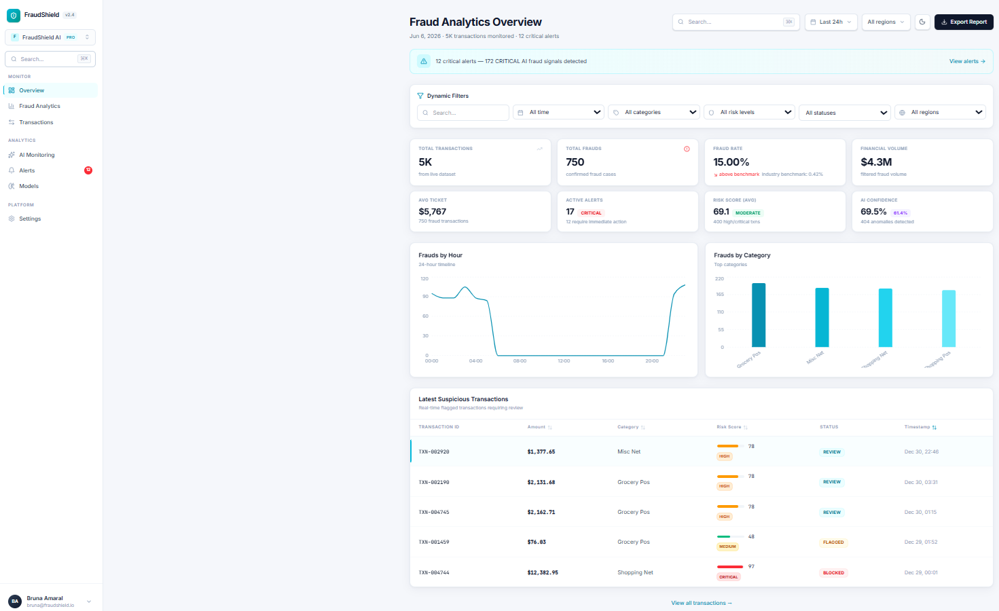
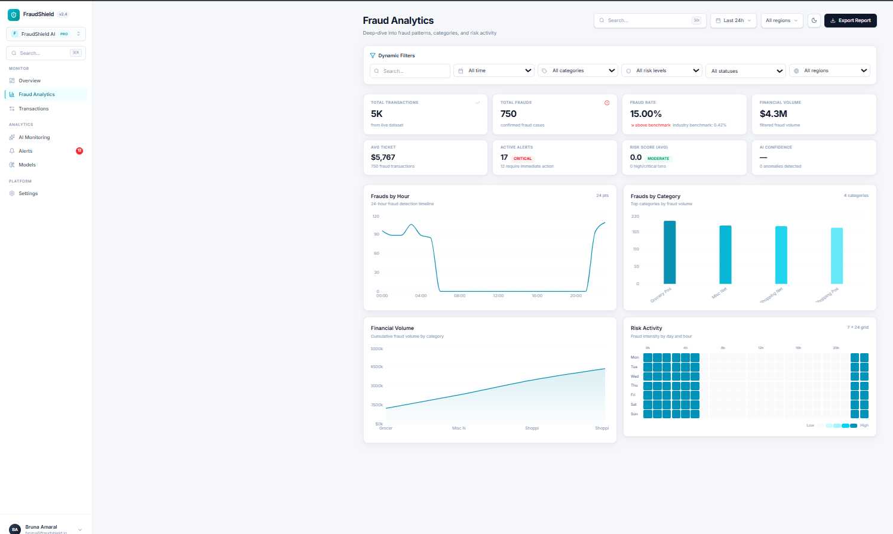
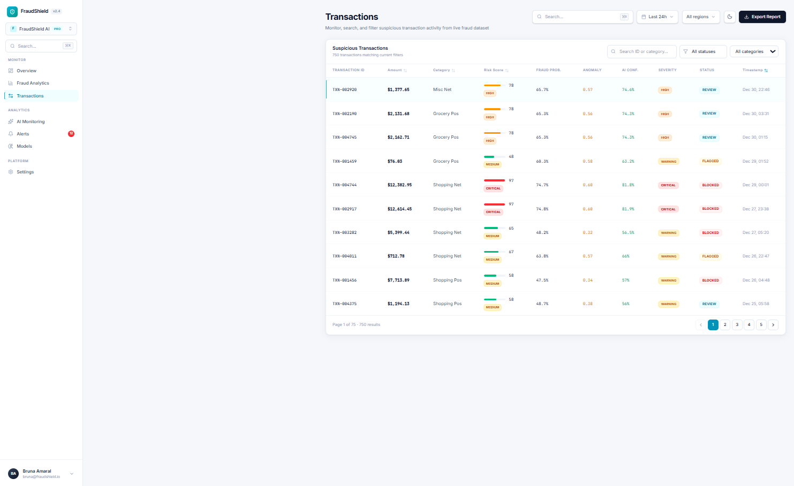
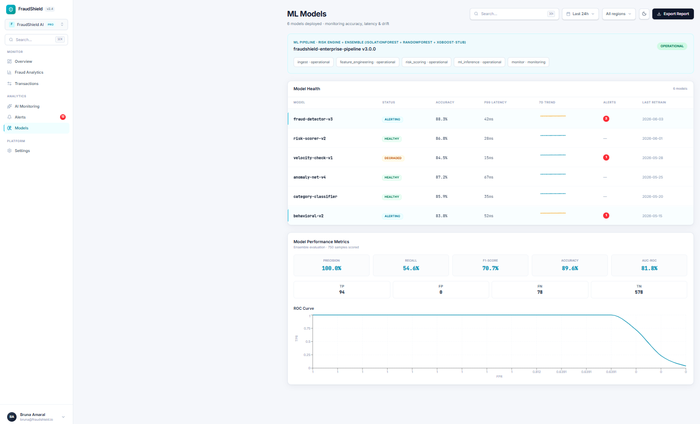

# FraudShield — Enterprise Fraud Analytics Platform

## Dashboard Preview

Visual tour da plataforma enterprise antifraude — **fraud analytics**, **AI monitoring**, **risk engine**, **machine learning** e **executive dashboard** em uma única superfície de observabilidade.

| Módulo | Descrição |
|--------|-----------|
| Overview | KPIs executivos, fraud rate e volume financeiro em tempo real |
| Analytics | Análise temporal, categorias e padrões de fraude |
| Transactions | Tabela dinâmica com risk score, AI confidence e modal de detalhes |
| Alerts | Alertas dinâmicos com severidade e badges contextuais |
| AI Monitoring | Distribuição de risco, probabilidade de fraude e anomaly timeline |
| Models | Métricas ML — Isolation Forest, Random Forest e pipeline de inferência |










---

Plataforma enterprise de monitoramento e detecção de fraude com frontend React interativo, backend analítico Node.js (MVC), estado global Zustand e filtros dinâmicos em tempo real.


## Visão geral

FraudShield consolida KPIs executivos, análise temporal, categorização de fraudes, score de risco multi-fator, alertas inteligentes, tabela interativa com modal de detalhes e pipeline ML — alimentado por **750 transações fraudulentas** (dataset demo de 5.000 linhas, otimizado para GitHub).

## Arquitetura

Consulte **[ARCHITECTURE.md](./ARCHITECTURE.md)** para diagrama completo, fluxo de dados e roadmap técnico.

```
fraud-lakehouse-platform/
├── backend/
│   ├── server.js
│   ├── routes/api.js
│   ├── controllers/         # health, analytics, transactions, ml
│   ├── services/            # analyticsService, mlService
│   ├── middleware/          # logger, ensureReady
│   ├── database/            # dataStore cache
│   └── lib/                 # riskEngine, filters, dataStore core
├── frontend/src/
│   ├── charts/
│   ├── components/
│   ├── contexts/            # barrel exports
│   ├── stores/fraudStore.js # Zustand global state
│   ├── services/api.js      # API centralizada + retry
│   ├── styles/global.css
│   └── pages/               # 6 rotas lazy-loaded
├── docs/                    # MVP audit, checklist, ML docs
├── ml/                      # Lakehouse pipelines (bronze/silver/gold)
├── screenshots/             # Preview images for GitHub README
└── data/                    # raw CSV + gold JSON (demo ≤5k rows)
```

## API Endpoints

| Método | Rota | Descrição |
|--------|------|-----------|
| GET | `/health` | Status + estatísticas |
| GET | `/kpis` | KPIs (suporta filtros) |
| GET | `/fraudes/categorias` | Fraudes por categoria |
| GET | `/fraudes/horarios` | Fraudes por hora |
| GET | `/transactions` | Transações paginadas |
| GET | `/transacoes` | Alias PT |
| GET | `/alertas` | Alertas dinâmicos |
| GET | `/modelos` | Saúde dos modelos ML |
| GET | `/analytics/summary` | Resumo + distribuição de risco |
| GET | `/ml/metrics` | Precision, recall, F1, confusion matrix |
| GET | `/risk-analysis` | Aggregated risk intelligence |
| GET | `/ml-predictions` | ML predictions with explanations |
| GET | `/anomalies` | Top behavioral anomalies |
| GET | `/fraud-insights` | AI insights + live alerts |
| GET | `/data-analysis` | Statistical dataset report |

Consulte **[docs/ML_MODELS.md](./docs/ML_MODELS.md)** para documentação completa dos modelos.

## AI Monitoring

Nova página **AI Monitoring** (`/ai-monitoring`) com:
- AI Risk Score Cards
- Fraud Probability / Anomaly Distribution
- Threat Timeline
- Fraud Intelligence Insights
- Live AI Alerts

Transações enriquecidas com: `fraud_probability`, `ml_prediction`, `anomaly_score`, `severity`, `ai_confidence`, `risk_explanation`

### Filtros (query params)

```
?period=24h|7d|30d|all
?category=grocery_pos
?status=blocked|review|flagged
?risk_level=CRITICAL|HIGH|MEDIUM|LOW
?region=West|South|Northeast|Midwest
?search=transaction_id
?page=1&limit=20&sort=timestamp&order=desc
```

## Data Pipeline (Lakehouse)

Dataset leve para portfólio — máximo **5.000 linhas**, regenerável localmente:

```bash
pip install -r ml/requirements.txt
python ml/pipelines/run_pipeline.py
```

| Camada | Saída | Git |
|--------|-------|-----|
| Raw | `data/raw/credit_card_transactions.csv` | ✅ commit (~481 KB) |
| Bronze | `data/bronze/fraud_raw_*.parquet` | ❌ gitignore |
| Silver | `data/silver/fraud_clean.parquet` | ❌ gitignore |
| Gold | `data/gold/*.json` | ✅ commit (backend lê estes) |

Consulte **[data/README.md](./data/README.md)** e **[docs/RECOVERY_REPORT.md](./docs/RECOVERY_REPORT.md)**.

## Como executar

### Backend (~2s com dataset demo)

```bash
cd backend
npm install
npm start
```

Aguarde: `[DATA] Ready: { transactions: 750, ... }`

### Frontend

```bash
cd frontend
npm install
npm run dev
```

Acesse: **http://localhost:5173** — proxy `/api` → `localhost:3001`

## Funcionalidades

- Estado global Zustand (filtros + KPIs + alertas sincronizados)
- Filtros globais: período, categoria, status, risk level, região, busca
- Modal de detalhes ao clicar em transação
- Lazy loading de páginas (code splitting)
- 6 páginas React Router + sidebar persistente
- Search global (⌘K) + Dark/Light mode
- Skeleton loading, empty states, retry automático
- Pipeline ML (Isolation Forest ready)
- Visual premium claro estilo enterprise SaaS

## Stack

| Camada | Tecnologias |
|--------|-------------|
| Frontend | React 19, Vite 8, Tailwind 4, Recharts, Zustand, Axios |
| Backend | Node.js, Express, csv-parse |
| Dados | JSON gold layer + CSV raw (7.506 fraudes) |

## Backups

Alterações são versionadas em `backups/refactor-YYYYMMDD-HHmmss/`

## Licença

Projeto de portfólio — dados para fins educacionais e demonstração técnica.
# fraudshield-ai-platform
Enterprise Fraud Analytics &amp; AI Monitoring Platform built with React, Node.js, Python and Machine Learning.
